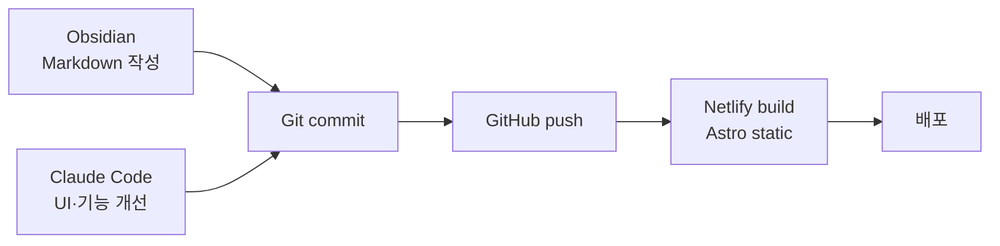

## 문제의식

글을 쓸 공간이 필요했다. 그러나 외부 플랫폼은 다음 한계가 있다.

- 플랫폼이 사라지면 글도 사라진다 (lock-in)
- UI·구성을 마음대로 바꾸기 어렵다
- 글쓰기와 기술 메모는 **성격이 달라** 한 곳에 섞이면 둘 다 손상된다

직접 만들고, 두 블로그를 분리한다.

## 접근

Astro content collection + Obsidian 작성 + GitHub push + Netlify 자동 배포.

작성과 배포를 분리한다. Obsidian에서는 글에만 집중하고, GitHub push가 트리거가 된다.

## 두 블로그 분리

| 블로그 | 성격 | 톤 가이드 |
|--------|------|-----------|
| 글쓰기 블로그 | 읽은 것·생각한 것 기록 | 서정적, 짧은 호흡, 구조보다 흐름 |
| 기술 블로그 | 개발 환경·도구·ML 메모 | 간결·기술적, `~이다` 체, 헤딩 구분 |

같은 인프라(Astro + Netlify)지만 톤·구조·메타데이터가 다르다. 합쳐두면 한쪽 톤이 다른 쪽을 침범한다.

## 주요 기능

- **독서 히트맵** — GitHub 스타일, 연도별·월별 독서 기록 시각화
- **포스트 분류** — 글쓰기·독서·생각 카테고리 필터
- **다크/라이트 모드** — `prefers-color-scheme` 감지 + 수동 토글
- **자동 TOC·사이드바** — 헤딩 추출해 사이드바 생성
- **프로젝트 카드** — frontmatter 기반 메타 + iframe 임베드 (이 페이지 같은 구조)

## 기술 결정

- **Astro** — content collection로 frontmatter 타입 안전성
- **Netlify** — GitHub 연동, 빌드 캐시
- **Obsidian** — 작성 도구 분리 (vault → repo 동기화 스크립트)
- **Claude Code** — UI 개선·리팩터링 작업 위임
- **Tailwind 4** — 디자인 토큰 일관화

## 작업 과정

1. 두 블로그의 톤·구조 요구사항 분리 정의
2. Astro 프로젝트 두 개 구성 — 공통 컨벤션은 `blog/CLAUDE.md`로 추출
3. Obsidian → Git 워크플로 정착 (`pnpm run format` 후 push)
4. 독서 히트맵·TOC·사이드바 등 공통 컴포넌트 개발
5. 프로젝트 카드 + iframe 임베드 시스템 (대시보드 직접 표시)
6. 점진 개선 — UI는 계속 조금씩 바뀐다. Claude Code가 수정 처리, 사용자는 글에 집중.
