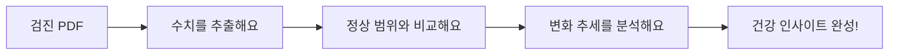

## 문제 — 건강은 점이 아니라 선이다

건강검진 결과표는 보통 그해 것만 보고 서랍에 넣는다. 그런데 진짜 상태는 수치 하나가 아니라 변화하는 흐름에 있다. 혈당이 정상이어도 3년째 오르고 있다면 얘기가 다르다.

## 어떻게 — PDF 속 수치를 깨운다

검진 PDF에 잠든 수치를 꺼내 건강 지도로 만든다.

빌드 한 번으로 5년 치 기록과 추세 차트가 최신으로 갱신된다.

## 기능

### 변화를 문장으로
- **추세 인사이트** — "혈당이 점진적으로 오르는 편"처럼 흐름을 짚는다
- **상태 표시** — 좋아지면 초록, 주의가 필요하면 강조 색
- **생활 습관 연결** — 식단·영양제 시점과 수치 변화를 함께 본다

### 대시보드
- 개선 중인지 주의인지 상단 카드에서 바로
- 차트에 정상 범위를 표시해 내 위치를 가늠

## 배경

단편적인 기록을 넘어 건강의 방향을 본다. 다만 의학적 판단을 대신하진 않는다. 참고용 지도다.
