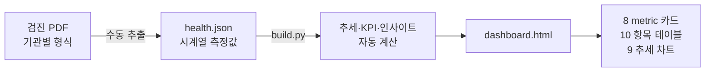

## 문제의식

검진 PDF는 매년 받지만 한 해치만 봐서는 맥락이 안 잡힌다.

- 혈당이 정상이어도 **3년 연속 오르면** 의미가 다르다
- 한 시점만 보면 **변곡점·전환점**이 안 보인다
- 기관마다 PDF 형식이 달라 직접 추출·비교가 번거롭다
- 식단·보충제 개입이 수치에 어떻게 반영됐는지 추적이 어렵다

연도별 수치를 누적해서 **방향성**을 봐야 한다.

## 접근

PDF → JSON → 빌드 스크립트로 dashboard 자동 갱신.

`build.py` 실행 한 번으로 8개 metric-big 카드, 9개 차트, 5년치 테이블, 인사이트 텍스트가 데이터 기반으로 일관되게 갱신된다.

## 도메인 규칙

정상 범위는 한국 검진 기준에 맞춰 코드화.

| 항목 | 정상 범위 |
|------|-----------|
| 공복혈당 | 70–99 mg/dL (≥100 당뇨 전단계) |
| 혈압 | <120/80 mmHg (≥130/90 고혈압) |
| HDL | ≥60 mg/dL 이상적 |
| LDL | <100 mg/dL 이상적 |
| AST/ALT | <40 U/L |
| 요산 | <7.0 mg/dL |
| 비타민D | ≥30 ng/mL 충분 |

추세 색상은 자동: 마지막 값이 다년 최저면 `td-ok`, 최고면 `td-bad`.

## 인사이트 자동 생성

- "다년 점진 상승 (82→85→88→91→94)" — glucose 추세
- "정점(125) 대비 −4" — 혈압 회복 폭
- "범위 45-52" — HDL 변동 폭
- BMI pill 자동 클래스 (정상/정상 상한/과체중)

데이터가 바뀌면 인사이트도 자동 갱신.

## 디자인 결정

- **라이트 모드 기본** + `prefers-color-scheme: dark` 자동 분기
- 정상 범위 시각화: 차트에 기준선·구간 띠 표시
- 5년치 추세는 셀 색상으로 (마지막 값 강조)
- "개선 중 / 주의 / 즉시 관리" 3단 요약 카드를 상단에 배치

## 작업 과정

1. 검진 항목 정규화 — 기관별 명칭 통일 (예: `공복혈당`, `Fasting Glucose`, `FBS` → 동일 키)
2. 정상 범위·위험 기준 수집 (대한가정의학회·검진 가이드라인)
3. dashboard markup 설계 — card-title을 anchor로 사용해 빌드 스크립트가 정확히 카드 단위로 매칭
4. `build.py` 작성 — health.json 입력 → 모든 metric·차트·인사이트 자동 갱신
5. 라이트 모드 추가 — CSS 토큰 변수화 + `@media` 분기로 시스템 설정 자동 반영
