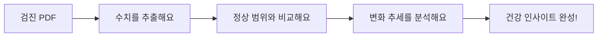

## 내 건강, 점이 아니라
선으로 보세요
건강검진 결과표, 올해 것만 보고 서랍 속에 넣어두진 않으셨나요? 진짜 내 건강 상태는 수치 하나가 아니라 **변화하는 흐름** 속에 있어요.

### 이런 점이 걱정되진 않으셨나요?
- 혈당이 정상 범위여도 **3년째 오르고 있다면** 주의가 필요해요.
- 작년보다 수치가 좋아졌다면 어떤 노력이 효과가 있었는지 궁금해지죠.
- 여러 곳에 흩어진 결과표를 한곳에 모아서 보고 싶을 때가 있어요.

## 이렇게 해결해봐요
PDF 파일 속 잠자고 있던 수치들을 깨워 나만의 건강 지도로 만들어보세요.

빌드 스크립트 실행 한 번으로 5년 치 기록과 추세 차트가 최신 데이터로 업데이트돼요.

## 이런 기능을 담았어요

### 내 몸의 변화를 문장으로 알려드려요
단순한 숫자를 넘어 나에게 의미 있는 정보를 찾아드려요.
- **지능형 인사이트**: "혈당이 점진적으로 상승하고 있어요"처럼 변화를 콕 집어 알려드려요.
- **자동 상태 표시**: 수치가 좋아지면 초록색으로, 주의가 필요하면 강조 색상으로 표현해요.
- **생활 습관 연결**: 식단 조절이나 영양제 섭취 시점에 따른 수치 변화를 함께 봐요.

### 보기 편한 건강 대시보드예요
누구에게나 직관적이고 친절한 대시보드를 지향해요.
- **상태 요약 카드**: 개선 중인지, 주의가 필요한지 상단 카드에서 바로 확인하세요.
- **안전 구간 시각화**: 차트에 정상 범위를 표시해서 내 위치를 바로 알 수 있어요.

## 이제 이렇게 달라져요
- 단편적인 기록을 넘어서, 내 건강의 **방향성**을 찾을 수 있어요.
- 내 몸의 변화에 맞춰 **행동 가이드**를 스스로 세울 수 있어요.
- 내 건강의 미래, 이제 데이터로 미리 준비해보세요.
