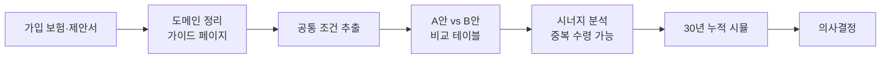

## 문제의식

보험 제안서는 길고 용어가 무겁다. 실손과 정액형이 섞이면 다음이 흐려진다.

- 두 상품의 **공통 조건**이 무엇인가
- 어떤 항목이 **차이**인가
- 두 상품을 함께 가입하면 **중복 수령**이 가능한가
- 30년 누적으로 보면 **어느 쪽이 더 이득**인가

상품을 같은 축에 올려두고 차이를 분리해서 보지 않으면 의사결정이 안 된다.

## 접근

세 단계로 구성한다.

각 단계는 별도 페이지로 분리한다.

| 페이지 | 역할 |
|--------|------|
| `korea_insurance_guide.html` | 1~4세대 실손, 갱신형 함정, 정액 중복수령 등 도메인 정리 |
| `insurance_dashboard.html` | 가입 보험 현황·월 보험료·보장 항목 한눈에 |
| `comparison_report.html` | 상품 A vs B 비교 + 시너지 + 30년 시뮬 |

## 한국 보험 도메인 키 포인트

| 개념 | 핵심 |
|------|------|
| 실손 세대 | 1~4세대, 갱신 주기·자기부담률 상이 — 갈아탈지 결정 기준 |
| 갱신형 함정 | 나이 들수록 보험료 급등 — 비갱신형 선호 |
| 정액 중복수령 | 실손과 달리 정액 특약은 여러 보험사 중복 지급 |
| 변액 수수료 | 납입액 대비 사업비 비중 확인 필수 |
| 납입면제 | 특정 진단 시 이후 보험료 면제 조건 |

## 비교 구조

A안과 B안의 **공통 베이스**를 먼저 분리한 뒤 차이만 강조한다.

- **공통 조건**: 성별, 나이, 건강 고지 사항 (변수 통제)
- **A vs B 차이**: 상품명, 보험료, 핵심 담보
- **시너지 섹션 필수**: 두 상품 동시 가입 시 중복 수령 가능 항목과 기대값
- **30년 시뮬**: 누적 납입 vs 누적 환급 → 순 이득 계산

## 작업 과정

1. 가입 중인 보험 정리 (실손·정액·생명·종신)
2. 도메인 학습 — 1~4세대 실손 차이, 갱신 구조, 정액 중복수령 규칙
3. 가이드 페이지 작성 — 의사결정 전 사전 지식
4. 비교 대시보드 — 가입 현황·월 보험료·보장 일람
5. 비교 리포트 — 공통 베이스 → A vs B → 시너지 → 30년 시뮬 순으로 구조화
