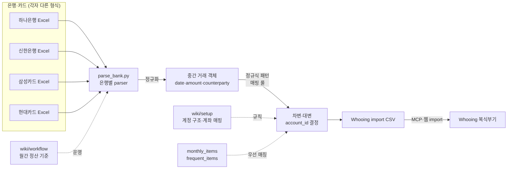

## 문제의식

복식부기 가계부는 차변·대변 매핑 규칙이 있어 raw 명세서를 그대로 붙여넣을 수 없다.

- 은행·카드사마다 Excel 형식이 다르다
- 같은 가맹점이라도 사용처에 따라 계정과목이 갈린다 (예: 스타벅스 → 식비? 친구비용?)
- 매달 수동 분류하면 기준이 흔들려 통계가 망가진다
- 자동이체·정기 결제는 매월 동일하게 들어가야 한다

수작업 45~55분이 매달 누적된다. **일관된 규칙**과 **자동화**가 필요하다.

## 접근

은행·카드 → 정규화 객체 → 패턴 매핑 → 후잉 import CSV로 연결한다.



핵심은 **패턴 매핑 룰의 외부화**다. 코드 안에 거래처 일일이 if/else로 박지 않고, 정규식·키워드 패턴을 별도 데이터로 분리한다.

## 매핑 룰 우선순위

```
1. monthly_items (매월 동일 입력 — 보험료·구독·관리비)
   ↓ 안 맞으면
2. frequent_items (자주 입력 — 단골 가맹점)
   ↓ 안 맞으면
3. 정규식 패턴 (가맹점명 부분 일치)
   ↓ 안 맞으면
4. 보류 → 사용자 수동 검토
```

이 순서가 깨지면 같은 가맹점이 매번 다른 계정으로 분류된다.

## 후잉 도메인 핵심

| 용어 | 의미 |
|------|------|
| 계정 (account) | 자산·부채·자본·수입·지출 5대 분류 |
| 항목 (account_id) | x11, x20 등 세부 계정과목 — 차변·대변 모두 항목 단위로 기입 |
| 차변(left) / 대변(right) | 복식부기의 양변 — 모든 거래는 양쪽에 동시 기입 |
| 아이템 (item) | 거래내역의 소분류 텍스트 ("스타벅스", "월급") |
| 거래처 (client) | 거래처 관리 항목이 매칭된 경우의 아이템 |

후잉 MCP를 통해 계정 구조 조회·거래 생성·자주입력 항목 동기화가 가능하다.

## 작업 과정

1. 후잉 MCP로 현재 계정 구조 일괄 조회 — `wiki/setup/whooing-structure.md` 정리
2. 은행·카드 Excel 형식 파악 — 컬럼·날짜 포맷·금액 부호 차이 정리
3. 은행별 parser 작성 (`parse_bank.py`) — 정규화된 거래 객체로 통일
4. 매핑 룰 정의 — monthly_items / frequent_items 우선, 그 다음 정규식 패턴
5. 월간 정산 워크플로 문서화 — `wiki/workflow/before.md` (자동화 전), `after/` (자동화 후)
6. 매월 import 결과를 `review/YYYY-MM-*.md`로 보관 — 룰 누락·오분류 발견 시 패턴 추가

수작업 45~55분 → 10분 이내로 감소.
