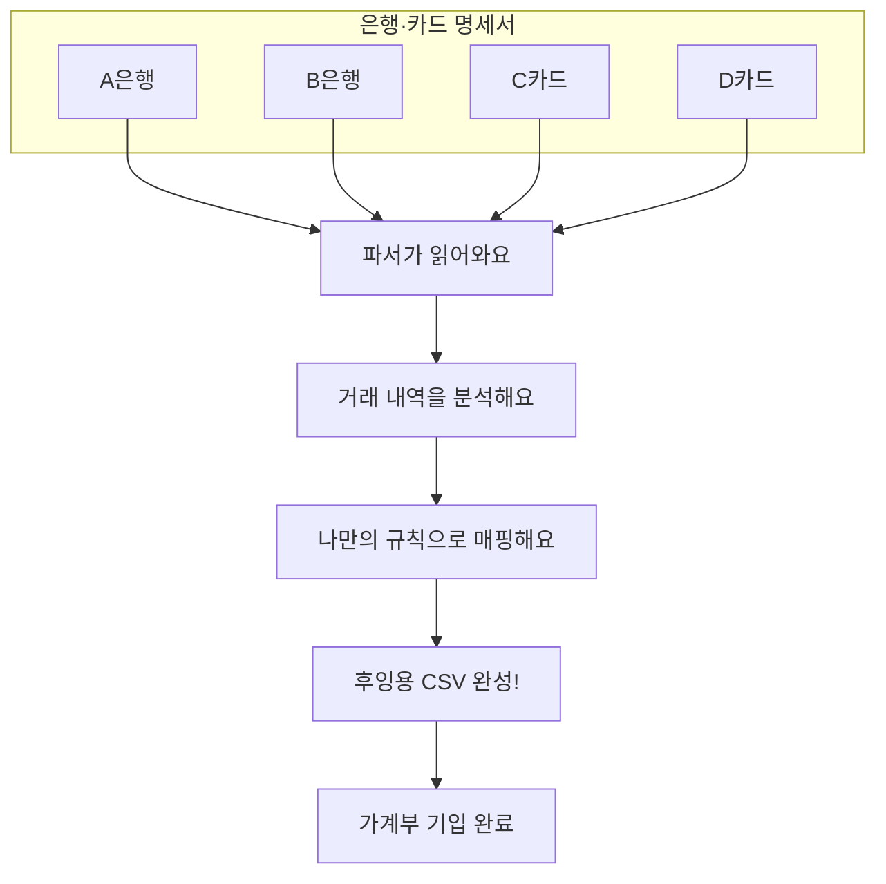

## 가계부 정리가
한결 쉬워질 거예요
복식부기 가계부는 참 좋지만, 매번 은행 내역을 옮겨 적는 건 참 번거로운 일이죠.

### 이런 점이 불편하셨죠?
- 은행마다 엑셀 형식이 다 달라서 일일이 고치는 게 힘들었어요.
- 같은 카페라도 상황에 따라 계정과목을 다르게 정하고 싶을 때가 있죠.
- 매달 반복되는 수작업만 1시간 가까이 걸리기도 해요.

이제 **일관된 규칙**을 정하고, 변환은 **자동화**에 맡겨보세요.

## 이렇게 해결해봐요
복잡한 데이터를 정제해서 후잉 가계부에 딱 맞는 형식으로 바꿔드릴게요.

단순히 글자만 바꾸는 게 아니에요. **매핑 규칙**을 따로 관리해서, 거래처 이름을 일일이 코드로 짤 필요가 없어요. 정규식과 키워드로 나만의 분류 체계를 만들어보세요.

## 이런 기능을 담았어요

### 매핑은 똑똑하게 진행돼요
분류가 겹치지 않도록 미리 정해둔 우선순위에 따라 척척 맞춰드려요.
- **정기 지출**: 보험료, 구독료, 관리비처럼 매달 나가는 항목을 가장 먼저 챙겨요.
- **자주 가는 곳**: 단골 가맹점은 미리 정해둔 계정으로 바로 연결해드려요.
- **똑똑한 이름 찾기**: 가맹점 이름의 일부만 보고도 어디인지 알아서 찾아내요.

### 후잉 가계부를 완벽하게 지원해요
복식부기의 핵심 개념을 시스템에 그대로 녹여냈어요.
- **계정과 항목 관리**: 자산부터 지출까지 세부 항목을 정확하게 기입해요.
- **차변과 대변**: 모든 거래가 양변에 동시에 기록되도록 꼼꼼하게 관리해요.

## 이제 이렇게 달라져요
- 1시간 걸리던 정산 시간이 **10분**으로 확 줄어들어요.
- 휴먼 에러 없이 항상 **일관된 규칙**으로 기록할 수 있어요.
- 남은 시간은 더 가치 있는 곳에 써보세요.
