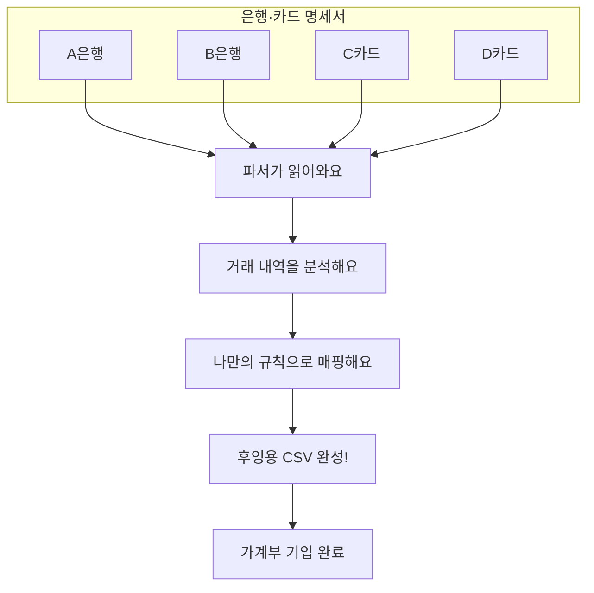

## 문제 — 가계부 입력은 번거롭다

복식부기 가계부는 좋지만, 은행 내역을 매번 옮겨 적는 게 일이다. 은행마다 엑셀 형식이 다르고, 같은 카페라도 상황 따라 계정과목을 다르게 두고 싶을 때가 있다. 매달 한 시간 가까이 수작업에 든다.

## 어떻게 — 규칙은 고정하고 변환은 자동으로

데이터를 정제해 후잉 가계부 형식으로 바꾼다.

글자만 바꾸는 게 아니다. 매핑 규칙을 따로 두어, 거래처를 일일이 코드로 짤 필요가 없다. 정규식과 키워드로 분류 체계를 만든다.

## 기능

### 똑똑한 매핑
우선순위에 따라 겹치지 않게 분류한다.
- **정기 지출** — 보험료·구독료·관리비처럼 매달 나가는 것부터
- **자주 가는 곳** — 단골 가맹점은 정해둔 계정으로 바로
- **이름 매칭** — 가맹점 이름 일부만 봐도 찾아낸다

### 후잉 지원
- 계정·항목 관리 (자산~지출)
- 차변·대변 양변 동시 기록

## 배경

한 시간 걸리던 정산이 10분으로 줄었다. 휴먼 에러 없이 일관된 규칙으로 기록된다 — 적어도 내 입력 방식에선 그렇다.
